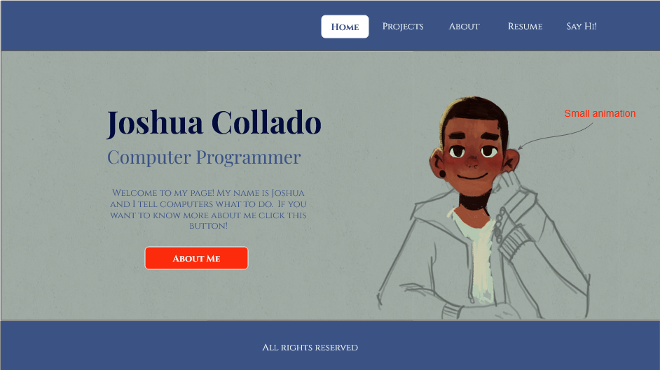

# Joshua's coding portfolio

## Project Overview

**Domain Name:** tbd

**Web Hosting Service:** Render

**Languages:** HTML, JavaScript, CSS

**Coding Tools:** VSCode

**Frameworks:** React, Tailwind CSS, Lighthouse, Express, Mongoose

**Version Control:** Github

**Design Tools:** Google Slides

## Site Structure

### Map

**Homepage:** A brief introduction, a showcase of previous projects, and a quick navigation to other sections.

**Projects:** A detailed gallery or list of all the projects.

**About:** A personal bio listing: background, skills, and experience.

**Resume:** An interactive version of the resume.

**Contact Page:** A contact form with backend handling.

### **Colors**

**UI:** 375171

**Background color:** B4C3BA

**Light Text:** EFF8F9

**Medium Text:** 375171

**Dark Text:** 020C3D

### Fonts

**General Text:** Cinzel size 10-18px

**H1 Header:** Playfair Display 30-40px

**H2 Header:** Playfair Display Normal 20-30px

---

## Homepage Development

### Last Modified

| Section                        | Last Modified Date |
| ------------------------------ | ------------------ |
| Homepage Development           | 2024-22-08         |
| Set Up Project Environment     | 2024-22-08         |
| Build HTML Structure           | YYYY-MM-DD         |
| Style the Homepage             | YYYY-MM-DD         |
| Implement Interactive Elements | YYYY-MM-DD         |
| Add Small Animation            | YYYY-MM-DD         |
| Test the Homepage              | YYYY-MM-DD         |
| Review and Refine              | YYYY-MM-DD         |
| Next Steps                     | YYYY-MM-DD         |

---

### Tasks

- [X] **Set Up Project Environment**

  - [X] Create a new project folder for the portfolio.
  - [X] Initialize a Git repository (`git init`).
  - [X] Set up `.gitignore` to exclude unnecessary files.
  - [X] Open the project in VSCode.
  - [X] Initialize the project with `npx create-react-app my-portfolio` .
  - [X] Install dependencies (React, Tailwind CSS, etc.).
- [ ] **Build HTML Structure**

  - [ ] Code the basic HTML layout based on the wireframe.
  - [ ] Create header, navigation bar, and footer.
  - [ ] Add title, subtitle, and general text sections.
- [ ] **Style the Homepage**

  - [ ] Apply Tailwind CSS (or custom CSS) to style the page.
  - [ ] Ensure font sizes, colors, and spacing match the wireframe.
  - [ ] Style the navigation bar with an active link indicator.
- [ ] **Implement Interactive Elements**

  - [ ] Code the "About Me" button with a link to the About section/page.
  - [ ] Add hover effects to the navigation links and button.
- [ ] **Add Small Animation**

  - [ ] Implement the planned animation using JavaScript (GSAP).
  - [ ] Test the animation for smoothness and performance.
- [ ] **Test the Homepage**

  - [ ] Test across different browsers (Chrome, Firefox, Safari).
  - [ ] Ensure responsive design on various screen sizes (desktop, tablet, mobile).
  - [ ] Check accessibility (semantic HTML, screen reader compatibility).
- [ ] **Review and Refine**

  - [ ] Perform a code review for best practices and clean code.
  - [ ] Share with peers or mentors for feedback.
  - [ ] Make necessary refinements based on feedback.

---

## Next Steps

- [ ] Develop the Projects page.
- [ ] Develop the About page.
- [ ] Develop the Resume page.
- [ ] Develop the Contact page.
